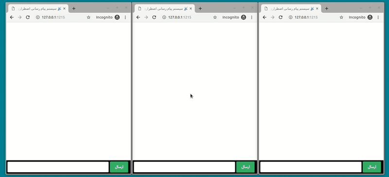

# Real Time Messaging Board

# How to install?
1. install composer ([reference](https://getcomposer.org/download/))

2. install swoole extension ([reference](https://www.swoole.co.uk/docs/get-started/installation))

3. run `git clone https://github.com/amirbagh75/real-time-messaging.git` to clone this repository 

4. run `composer install` in the root directory of application

5. run `cp .env.example .env`

6. run `php artisan key:generate`

7. run `php artisan swoole:http start` and everything should be ok now 😬

   

# Future plans?

- [ ] Add support for nicknames.
- [ ] add database.
- [ ] add is typing !
- [ ] mobile application
- [ ] desktop application
- [ ] cli application
- [x] prevent empty string in messages
- [ ] prevent send many messages in very short time !
- [ ] Scalability for 1 milion user !
- [ ] notifications for new messages.
- [ ] dockerize
- [ ] unit tests
- [ ] rewrite client with Vue.js
- [ ] write architecture document
- [ ] add user to user chat
- [ ] add chat rooms
- [ ] add join/left message for rooms
- [ ] send image/video/document/voice
- [ ] add voicecall/videocall support

# Any problem?

please open a issue !

